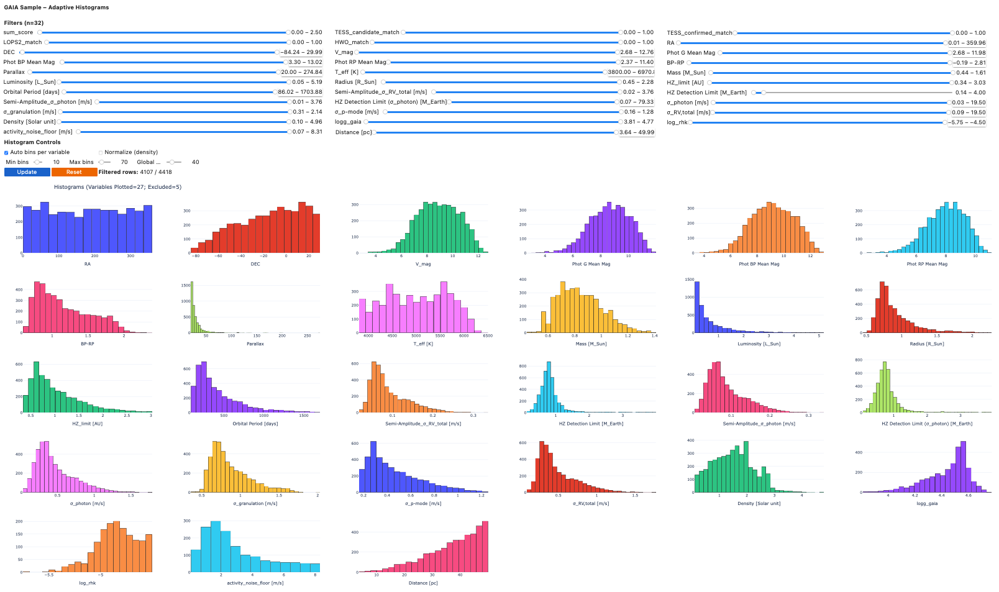

# Interactive-2ES-Target-List-Explorer

Explore and analyze the Gaia target list interactively in your browser. You can launch the interactive histogram explorer (powered by Binder and Voilà) using the button below:

Alternatively, open the explorer in a standard Jupyter notebook interface [here](https://mybinder.org/v2/gh/exoplanetsdk/Interactive-2ES-Target-List-Explorer/HEAD?urlpath=%2Fdoc%2Ftree%2Fnotebooks%2FInteractive_2ES_Targets_Explorer.ipynb).

*Note: The first launch may take a few minutes to initialize.*

